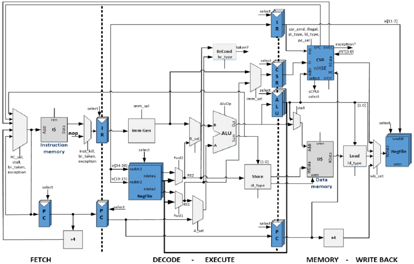
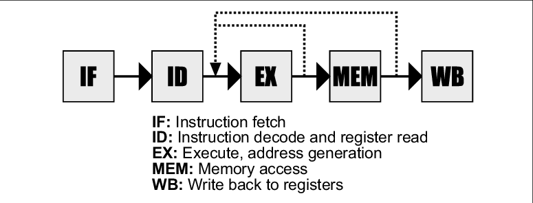
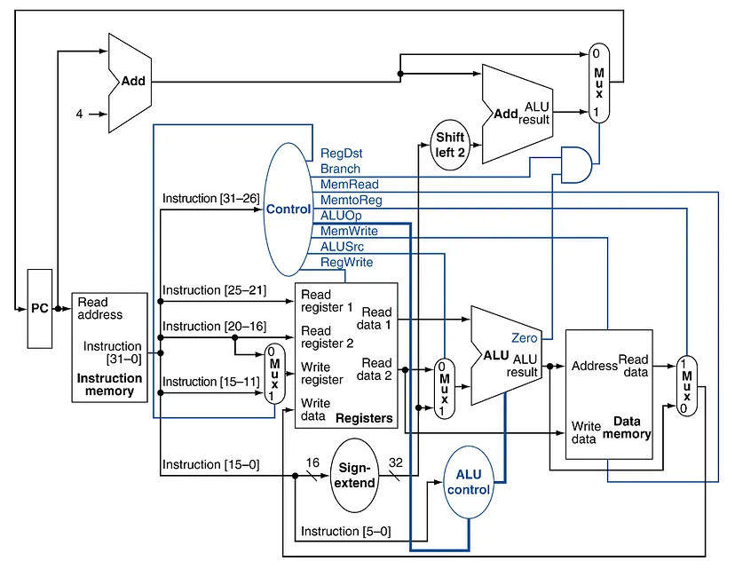
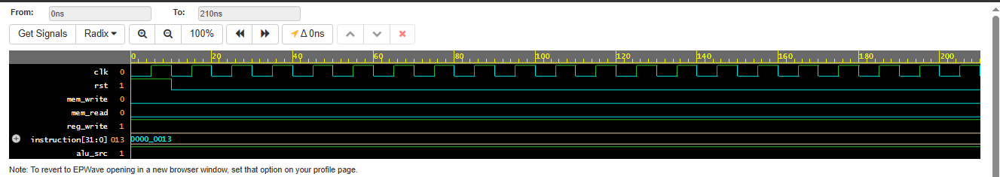
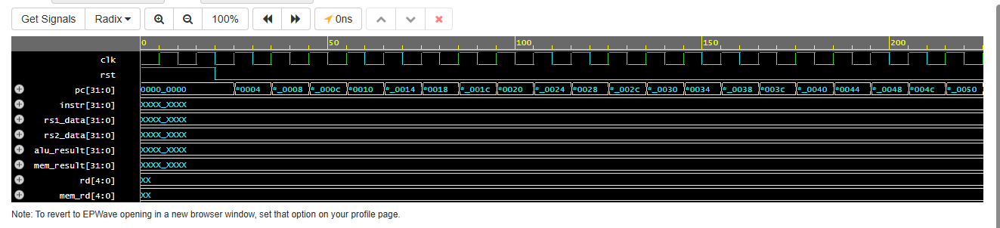

# RISC-V Processor Design in SystemVerilog

## Single-Cycle and 5-Stage Pipelined CPU

This repository presents the RTL implementation of a **32-bit RISC-V processor** written in **SystemVerilog**, supporting both:

• Single-Cycle Processor Architecture
• 5-Stage Pipelined Processor Architecture

The design demonstrates key processor microarchitecture concepts including instruction decoding, ALU execution, register file operation, pipeline stage separation, memory access, and assertion-based verification.

Simulation and verification were performed using **EDA Playground with Verilator v5.044**.

---

# Project Overview

Modern processors improve performance by executing multiple instructions simultaneously using **pipelining**.

This project implements a simplified **RV32I RISC-V processor** that demonstrates:

• Instruction execution flow
• Datapath design
• Pipeline stage implementation
• SystemVerilog verification

Two processor architectures are explored:

### Single-Cycle Processor

All operations required for an instruction are completed within **one clock cycle**.

### Pipelined Processor

Instruction execution is divided into stages so multiple instructions execute **concurrently**, improving throughput.

---

# System Architecture

Processor data flow:

Instruction Memory → Instruction Decode → Execute → Memory → Writeback

Pipeline stages:

IF → ID → EX → MEM → WB

This structure allows different instructions to execute in different stages simultaneously.

---

# RISC-V Instruction Set


The processor supports a subset of the **RV32I instruction set**.

Supported instructions include:


| Instruction Type | Examples          |
| ---------------- | ----------------- |
| R-Type           | ADD, SUB, AND, OR |
| I-Type           | ADDI, LW          |
| S-Type           | SW                |
| B-Type           | BEQ               |
| U-Type           | LUI               |
| J-Type           | JAL               |

These instructions cover arithmetic operations, memory operations, and control flow instructions.

---

# Processor Block Diagram



This diagram illustrates the major hardware blocks used in the processor.

### Program Counter

Maintains the address of the current instruction.

Function:
• Provides instruction address to instruction memory
• Updates to the next instruction address after execution

---

### Instruction Memory

Stores the program instructions executed by the processor.

Features:

• Addressed using the program counter
• Outputs instruction to the decode stage

---

### Control Unit

The control unit interprets instruction opcodes and generates control signals for the datapath.

Control signals include:

RegWrite
ALUSrc
MemRead
MemWrite
MemtoReg
Branch

---

### Register File

Stores the processor’s general-purpose registers.

| Feature     | Value   |
| ----------- | ------- |
| Registers   | 32      |
| Width       | 32 bits |
| Read Ports  | 2       |
| Write Ports | 1       |

Register **x0 always contains zero** as defined by the RISC-V specification.

---

### ALU

The Arithmetic Logic Unit performs arithmetic and logical operations.

Supported operations include:

ADD
SUB
AND
OR
SLT

Operands are obtained from the register file or immediate values.

---

### Data Memory

Handles memory operations during instruction execution.

Supported instructions:

LW – Load word
SW – Store word

Memory access occurs during the **MEM pipeline stage**.

---

# Pipeline Architecture


The processor uses a **five-stage pipeline architecture**.

### IF – Instruction Fetch

The instruction is fetched from instruction memory using the program counter.
Pipeline registers used:
• IF/ID
• ID/EX
• EX/MEM
• MEM/WB

### ID – Instruction Decode

The instruction is decoded and operands are read from the register file.

### EX – Execute

The ALU performs arithmetic or logical operations.

### MEM – Memory Access

Load and store instructions access data memory.

### WB – Write Back

The result is written back to the register file.

Pipeline registers between stages enable **parallel instruction execution**.

---

# Processor Datapath


The datapath illustrates how data flows through the processor during instruction execution.

Key datapath components include:

Program Counter
Instruction Memory
Register File
Immediate Generator
ALU
Data Memory
Writeback Multiplexer

The datapath interacts with the control unit to execute instructions correctly.

---

# Verification Environment

The processor is verified using a **SystemVerilog testbench environment**.

Verification components include:

Driver
Monitor
Instruction Sequence
Environment

These components simulate instruction execution and monitor processor activity.

---

# Testbench Architecture

### Driver

Initiates processor operation during simulation.

Example behavior:

Displays execution message and starts instruction flow.

---

### Monitor

Observes processor signals and reports activity during simulation.

---

### Instruction Sequence

Generates instructions used to test processor functionality.

Example instructions used:

```id="bdfm2c"
32'h003100B3
32'h40628233
32'h0002A303
```

These instructions test ALU operations and memory access functionality.

---

# Assertion-Based Verification

SystemVerilog assertions are used to verify correct processor behavior.

Example assertion:

```id="2t3v7n"
property no_write_x0;

 @(posedge clk)
 disable iff(rst)
 (dut.mem_rd == 0) |-> (dut.mem_result == 0);

endproperty

assert property(no_write_x0);
```
Explanation:

The property is evaluated on every rising clock edge.

disable iff(rst) disables the check during reset.

The implication operator |-> specifies that if the memory read signal (mem_rd) is 0, the memory output (mem_result) must also be 0.

Purpose

This assertion verifies that memory output data is only valid when a memory read operation is enabled, preventing unintended values from appearing on the memory output during simulation
This assertion checks that memory results are not written when memory read is disabled.

Assertions help detect functional errors during simulation.

---

# Running the Simulation

Simulation is performed using **EDA Playground**.

### Single-Cycle Processor

https://www.edaplayground.com/x/dkzw

### Pipelined Processor

https://www.edaplayground.com/x/DSCK

Steps:

1. Open the EDA Playground link
2. Load RTL files in the design section
3. Load the testbench file
4. Run simulation
5. View waveform using EPWave

---

# Simulation Waveform
Single Cycle Processor Waveform



The waveform confirms correct processor operation.

Signals verified include:

Clock signal
Reset signal
Instruction execution
ALU result generation
Memory read/write operations
Pipeline stage transitions

The single cycle waveform verifies that each instruction completes execution within one clock cycle.

Waveform analysis confirms proper instruction execution through the pipeline stages.

--- 

Pipelined Processor Waveform


Explanation

The pipelined waveform demonstrates how multiple instructions execute simultaneously across pipeline stages.

Signals verified include:

Instruction fetch sequence
ALU operations
Memory access
Register writeback
Pipeline stage transitions

The waveform confirms correct pipeline behavior.

---

 ## Tools Used

• SystemVerilog for RTL design  
• Verilator v5.044 for simulation  
• EDA Playground for running simulations  
• EPWave for waveform visualization

# Design Highlights

• Implementation of RV32I processor architecture
• Single-cycle and pipelined CPU designs
• Modular SystemVerilog RTL design
• Assertion-based verification
• Functional simulation and waveform validation

--- 

# Future Improvements

* Branch Prediction
* Caching
* RV32M Extension
* Interrupt Handling
* Exception Handling

---

# Author

Sravanthi Vangara
VLSI Design | RTL Design | Digital Systems
